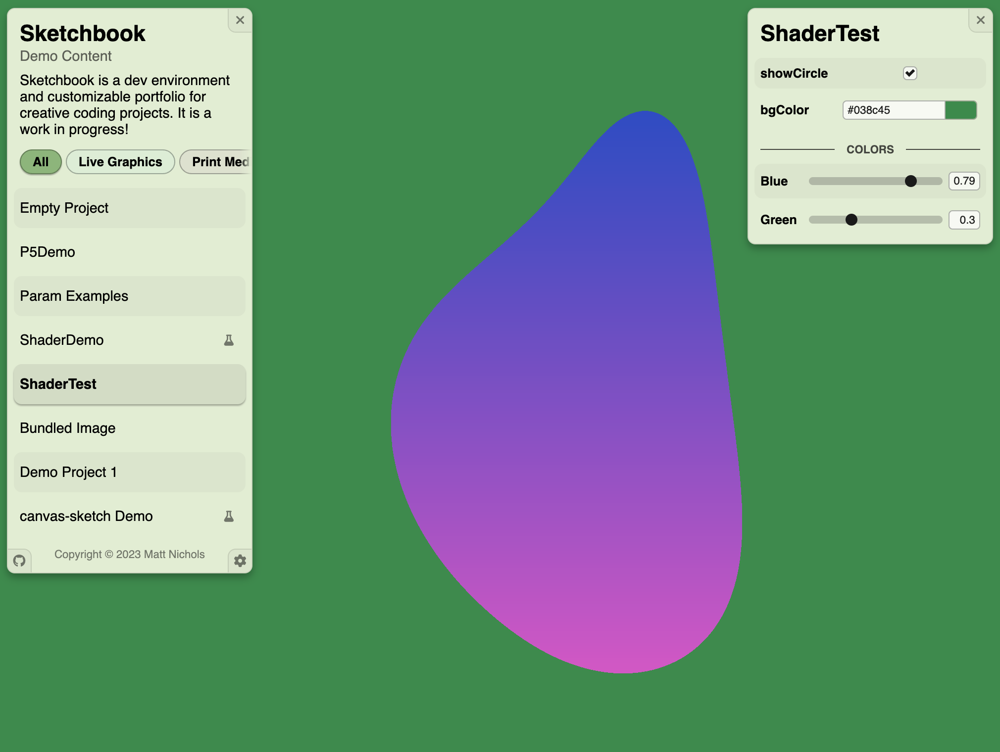

# Sketchbook Overview

Sketchbook is a forkable development environment for HTML canvas artwork & prototypes. Sketchbook is also a customizable webapp for publishing these projects. Read on for a conceptual overview, or jump right into the [Quick Start Guide](quick-start.md)!

_Screenshot from a Sketchbook deployment, available live [here](https://demo.skbk.cc). [todo: update screenshot]_

### How It Works

After forking the [Sketchbook repository](https://github.com/flatpickles), you can build your own projects within it, as subclasses of a generic `Project` class. The Sketchbook webapp provides a managed HTML canvas to these project implementations, and will call a set of lifecycle functions, but otherwise leaves rendering up to you. You can draw to the canvas directly, use your favorite web graphics framework (e.g. p5.js), make shader art, or whatever else you like to do.

In addition to giving you a friendly way to organize and view canvas projects, Sketchbook also automatically displays UI inputs for any instance variables declared on `Project` subclasses. A wide variety of parameter types and styles are supported, and Sketchbook also provides a "preset" interface for switching between pre-defined collections of parameter values. Sketchbook's parameterization system is easy to understand and use, but nonetheless facilitates the design of highly configurable projects. _[Note: presets are still [on the roadmap](https://github.com/flatpickles/sketchbook/issues/21).]_

Sketchbook is a webapp at its heart, and when you want to publish your projects, you can simply deploy the app on a hosting provider of your choice. No frontend work is required outside of your canvas drawing code, but your audience will be able to view and interact with your projects via the same interface you've been using during during development. If you'd rather publish your projects in isolation, your code is portable: Sketchbook's relatively unopinionated nature makes it easy to move your work into other contexts.

### Diving In

If you're ready to try out Sketchbook, continue on to the [Quick Start Guide](quick-start.md) and follow the instructions to get set up! You can also continue learning about how projects and parameters are modeled within Sketchbook on the [Project Class](project.md) page, and explore the other documentation pages linked from the sidebar on the left.

Every attempt has been made to deliver a stable and polished platform for your creative work, but Sketchbook is under active development. If you encounter any bugs, have trouble incorporating your tools and techniques, or find this documentation lacking in any way, please [file a GitHub issue](https://github.com/flatpickles/sketchbook/issues/new)! PRs are also welcome for any improvements or added functionality; you can find more notes on contributing to Sketchbook [here](contributing.md).
