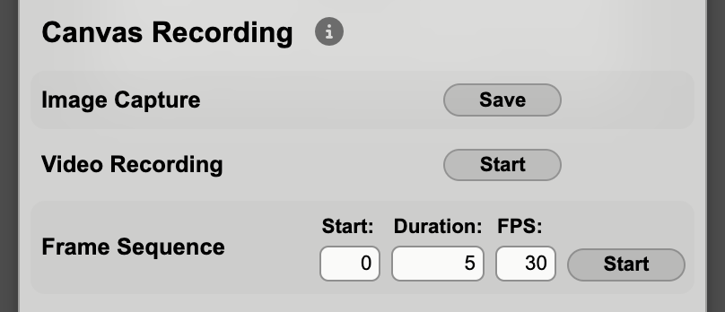

# Canvas Recording

Sketchbook offers built-in tools for capturing images and videos of your projects, which you can use to export shareable assets. These tools are accessible within the Settings overlay:



## Photo & Video Capture

"Image Capture" will save a PNG snapshot of the currently rendered project, in its current display dimensions. If you want to use specific image dimensions (e.g. 1080x1080 for Instagram), disable full screen rendering and adjust the default canvas size in your settings before capturing.

"Video Recording" provides a Start/Stop toggle, allowing you to record a video of the current project for however long you wish. The recording will continue even while the Settings overlay is closed, so you can easily record the effects of parameter changes or other project interactions. Changing the project or display dimensions while recording is unsupported.

Video recordings are recorded at 30 frames per second, and saved in WebM format. If you like, you can change the FPS and quality settings for your Sketchbook within the `FrameRecorder.ts` file. To convert a WebM video to an MP4 video suitable for sharing on social media platforms, try this ffmpeg command:

```
ffmpeg -i input.webm -c:v libx264 -pix_fmt yuv420p -crf 23 -preset slow -tune animation -movflags +faststart -profile:v high -level 4.2 output.mp4
```

Direct video recording from Sketchbook is flexible and convenient, but might not yield the best results. Because Sketchbook uses a `requestAnimationFrame` update loop to draw each frame, it can yield inconsistencies and phasing artifacts when sampled at a static framerate for video recording. The RAF implementation is a web graphics best practice for smooth live rendering, but for the highest quality in recorded animations, consider using a frame sequence recording.

## Frame Sequence Recording

A frame sequence recording will capture individually rendered frames as PNG files, and save them all within a single zip file. Before starting the frame sequence, you can configure the start time (in seconds), the duration (also seconds), and the framerate for the recording. When you click "Start", `init` will be called again for your project, then `update` will be called once for each frame in the resulting render. The `time` values provided to `update` are calculated precisely from the configured start time, duration, and frame index, and each frame is rendered as quickly as possible, so the total render may happen faster than realtime.

In addition to avoiding video artifacts (as discussed above), the frame sequence tool also lets you record precisely timed animations, e.g. those intended to be played in a perfect loop. You can design your animations to cycle over a specific period of time, and then record exactly that amount of time as a frame sequence.

Exporting frame sequences also gives you full control over video encoding. After downloading your frame sequence, you can use an ffmpeg command like this one to create a shareable MP4 asset:

```
ffmpeg -framerate 30 -i %05d.png -c:v libx264 -pix_fmt yuv420p -crf 23 -preset slow -tune animation -movflags +faststart -profile:v high -level 4.2 output.mp4
```
