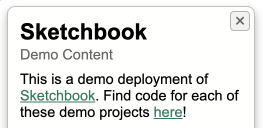

# Content & Copy

Sketchbook ships with reasonable defaults, but you may wish to customize assorted text and other content that is displayed throughout the app. An example of customizable content is the title, subtitle, and description in the [demo deployment](https://demo.skbk.cc):

App text, [Font Awesome](https://fontawesome.com/) icons, and other content can be customized within `src/config/content.ts`. See the `content.ts` file [on GitHub](https://github.com/flatpickles/sketchbook/blob/main/src/config/content.ts) or in your code editor for commented descriptions of each option, and configure your preferences by editing this file in your Sketchbook.

### Open Graph Content

Properties in `content.ts` are relatively self-explanatory, though perhaps with the exception of `openGraphContent`. Here you can set options that will be used for link previews in messaging and social platforms, using the [Open Graph protocol](https://ogp.me/). Options are follows:

-   `siteName`: The title of the whole site, e.g. "Sketchbook".
-   `title`: The title of the home page, returned only for the root URL. On project pages, this value will be overridden with the project's title.
-   `description`: A description of the home page, returned only for the root URL. On project pages, this value will be overridden with the project's description.
-   `imageName`: The name of an image file to use as the site/project preview, with or without a file extension. Sketchbook will look for an image with this name at the top level of `src/art` to use as the link preview image. Each project directory can also contain a preview image with this name, e.g. `src/art/ProjectKey/preview.png`, which will override the top-level preview image for that project.
-   `url`: The canonical base URL where your Sketchbook is deployed. Project-specific URLs will be generated with this base.
-   `author`: Your name, if you'd like it to be available for project link previews.
-   `locale`: Your locale, if you'd like to specify.

### Favicon

You may also wish to change your Sketchbook's favicon from the default [OpenMoji icon](https://openmoji.org/library/emoji-1F5BC/). To do so, replace the related icon files in the `static` directory, following the helpful advice on [this page](https://medium.com/swlh/are-you-using-svg-favicons-yet-a-guide-for-modern-browsers-836a6aace3df).
