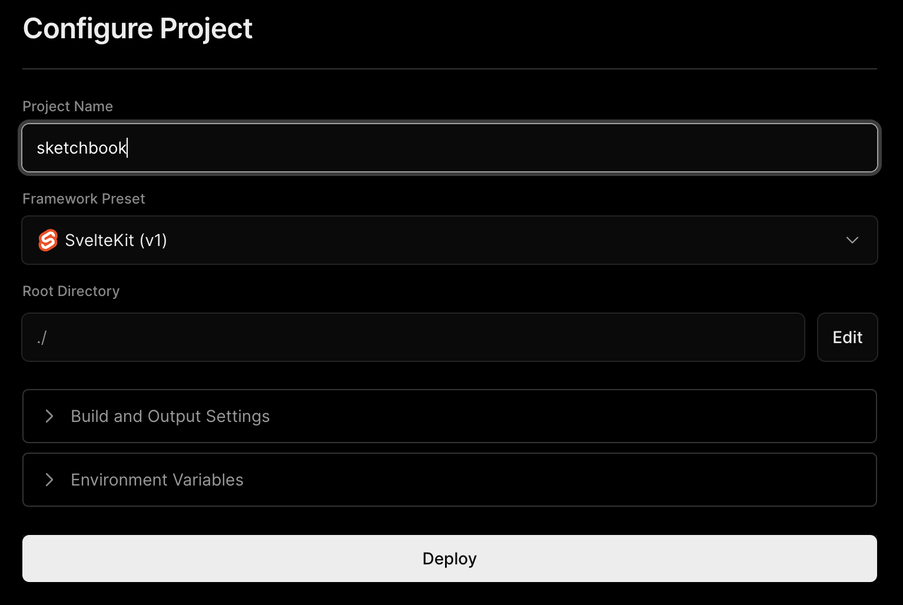

# Deploying Sketchbook

Sketchbook is a SvelteKit project under the hood, and thus can be built and deployed as described in the [SvelteKit docs](https://kit.svelte.dev/docs/building-your-app) without any further configuration.

One of the easiest ways to publish your Sketchbook repository is by using Vercel's free hosting. [Create a new project](https://vercel.com/new) on Vercel, then link the GitHub account where you've pushed the latest changes to your copy of Sketchbook, and find Sketchbook listed among your repositories. Select your Sketchbook repository, and click "Deploy" – the default configuration should work just fine.

Vercel will automatically build and deploy your Sketchbook to a `vercel.app` subdomain, but you can also follow their instructions to easily configure custom domains. When you next push to your Sketchbook repo on GitHub, Vercel will automatically pick up your changes and redeploy.
