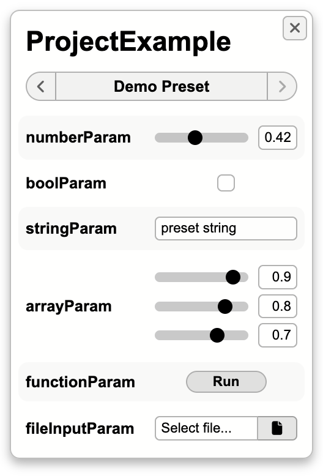
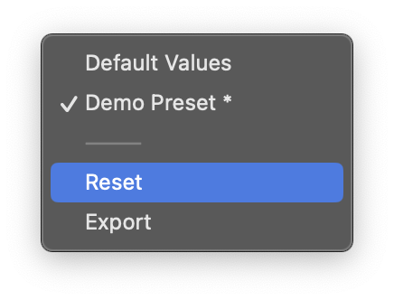

# Parameters & Presets

While building art and prototypes in code, we typically want to create parameterizable systems, i.e. projects that change in appearance or behavior depending on a collection of configurable inputs. Depending on how you like to work, you might be "tuning" values while perfecting your final product, or you might be designing an abstract system that can achieve many different goals depending on how it's configured.

One of Sketchbook's core features is its parameter system: you can easily define and use parameters within a project implementation, and these parameters will be presented with adjustable inputs alongside your project in the Sketchbook app. You can also define "presets": curated collections of parameter values that a viewer can easily flip through.

## Implementing Parameters

As seen in the [Quick Start Guide](quick-start.md), defining parameters for Sketchbook projects simply requires defining properties within your project class:

```ts
import Project from '$lib/base/Project/Project';

export default class ProjectExample extends Project {
    numberParam = 0.7;
    boolParam = true;
    stringParam = 'hello world!';
    arrayParam = [0.1, 0.2, 0.3];
    functionParam = () => {
        alert(this.stringParam);
    };
    fileInputParam = (dataURL: string, metadata: File) => {
        console.log(dataURL);
    };
}
```

If you create and save a project with the parameters defined above, Sketchbook will automatically make them available in the app UI:


As you can see, Sketchbook natively supports a variety of parameter types, including numbers, booleans, strings, numeric arrays, and functions. File input is also supported, via functions that are called with a [data URL](https://developer.mozilla.org/en-US/docs/Web/API/FileReader/readAsDataURL) and a [File](https://developer.mozilla.org/en-US/docs/Web/API/File) metadata object (unless otherwise configured).

The default parameter values set in your project file will be used as the initial values in the UI, and when the UI inputs are updated, the corresponding property values will be updated for the current project instance. Parameter value updates will be stored between Sketchbook sessions, and your projects will reload with the same values that were previously configured in the UI. The default values will only be used again if Sketchbook is reset, or when you update the values in your project file.

Changing a value in the UI will cause the `paramUpdated` [lifecycle method](project.md?id=project-methods) to be called for your project instance, though you shouldn't often need to use this. Because Sketchbook also updates the parameter instance variables for your class, you can implement parameterized behavior declaratively, e.g. simply referencing the current values of your parameters in your `update` code.

If you like, you can set the values of your parameterized instance variables directly within your project code, and the parameter UI will update accordingly. Whenever you wish to maintain state in instance variables _without_ seeing these variables in the parameter UI, use the hash prefix to define [private properties](https://developer.mozilla.org/en-US/docs/Web/JavaScript/Reference/Classes/Private_class_fields), or add the name of your state variable to an `ignoreKeys` override in your `Project` subclass.

Sketchbook provides reasonable default UI for each supported parameter type, but there are also many configuration options available for the behavior and appearance of your parameters. You can read more about configuring parameters on the [Parameter Configuration](param-config.md) page.

## Presets in Sketchbook

Presets in Sketchbook are modeled as JSON objects, and stored in `.json` files. These files are contained in a `presets` directory alongside the associated project file, and Sketchbook will automatically make these presets available from a preset selector in the app UI. When a preset is selected, Sketchbook will set each parameter to the value indicated in the preset file. A preset file might look like this (for the parameters defined in `ProjectExample` above):

```json
{
    "title": "Demo Preset",
    "values": {
        "numberParam": 0.42,
        "boolParam": false,
        "stringParam": "preset string",
        "arrayParam": [0.9, 0.8, 0.7]
    }
}
```

If you were to create a JSON file with this code in a project's `presets` directory, you'd see this preset in the Sketchbook UI:



Presets can only contain values for parameters that have values, so function-based parameters (including file inputs) cannot have their values set in a preset. Within a preset, each parameter value is optional. If a parameter's value isn't specified in a selected preset, it will not be changed from its value prior to loading the preset.

Sketchbook automatically creates a "Default Values" preset, and will display this as the first preset when other presets are available. If you'd like to override default values in the "Default Values" preset, or create a custom title for a project's default preset, you can create a `presets/defaults.json` preset file. Any values contained in `defaults.json` will be used instead of the default values defined elsewhere (e.g. via inline definitions in your TS project file).

Sketchbook tracks which parameter values have varied from the selected preset value, and you'll notice an asterisk (\*) appear next to the preset name if any values have changed. Edited parameter values can be reset to the current preset values via the "Reset" option in the selector dropdown.



When enabled in the [app settings](settings.md), you'll also see an "Export" option in the selector dropdown. This provides an easy way to generate JSON files from the current project values, so you can create preset files without having to type them out by hand. After exporting a preset file, you can simply drop it into your project's `presets` directory to see it listed in the selector UI.
