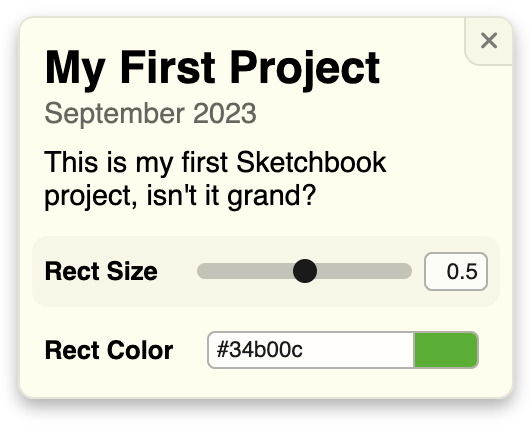

# Quick Start Guide

Welcome to the Quick Start Guide for Sketchbook! This is a guide to getting an instance of Sketchbook up and running on your local machine, creating your first project, and exploring some basic configuration options. Let's go!

### Fork the Repo

Sketchbook is an open source project hosted on GitHub. Though you could clone it directly for local use, forking the repository will make it much easier for you to [update](updating.md) Sketchbook, and [publish](deploying.md) your projects whenever you are ready to do so.

To **fork the main Sketchbook repository**, you can use [this direct link](https://github.com/flatpickles/sketchbook/fork). Select the owner (your GitHub account or organization), edit the name and description if you wish, and click the "Create fork" button. You now have a copy of Sketchbook in your GitHub account!

You must now **clone your Sketchbook** locally to build within it. Navigate to your Sketchbook fork on GitHub, then click the "Code" dropdown, and choose whatever method you prefer to clone the repository.

_Forks on GitHub are public repositories. If you'd like to create a private Sketchbook, you'll need to duplicate the repository into a private mirror instead of forking; GitHub provides relevant instructions [here](https://docs.github.com/en/repositories/creating-and-managing-repositories/duplicating-a-repository)._

### Open Your Editor

Before proceeding, navigate into your local Sketchbook project: `cd sketchbook`

All Sketchbook projects will be contained within the `src/art` subdirectory, so you can just open that directly, e.g. `code src/art` if you use the VSCode CLI.

Sketchbook includes a few demo projects for your reference. Feel free to use or delete these as you see fit; they'll always be available [here](https://github.com/Longitude-Studio/sketchbook/tree/main/src/art)!

_Sketchbook's global configuration files are located in `src/config`, not in `src/art`. For now, let's just focus on creating our first project!_

### Run Sketchbook Locally

You can **run the dev server** with `npm run dev`. Sketchbook is now running on your local machine (perhaps at [http://localhost:5173](http://localhost:5173)), and Vite will hot-reload the app any time you save a file. Make sure you have a browser window open with your local Sketchbook running before you proceed!

_Sketchbook is a SvelteKit project, but you won't really notice. You don't need to know anything beyond the basics noted here, but if you're interested, check out the [development notes](dev-notes.md)._

### Create Your First Project

Within `src/art`, create a new TypeScript or JavaScript file within a directory of the same name, e.g. `src/art/MyProject/MyProject.ts` (we'll use TypeScript below). Check your browser: "MyProject" now appears in the project list!

Before selecting your new project in the panel, export a default class that extends the base [`Project`](https://github.com/flatpickles/sketchbook/blob/main/src/lib/base/Project/Project.ts) class:

```ts
import Project from '$lib/base/Project/Project';
export default class MyProject extends Project {}
```

_You'll see errors if you try to view MyProject without exporting a default class, or if the class you export doesn't inherit from `Project`. The main project file (i.e the file with the name that matches its project subdirectory) must always export a `Project` subclass._

### Get Pixels on the Screen

After selecting "MyProject" in the project list panel, you won't see anything beyond a white screen. Let's change that! Define an `update` method within your new class, and have it draw a simple rectangle:

```ts
export default class MyProject extends Project {
    update() {
        const ctx = this.canvas?.getContext('2d');
        if (!this.canvas || !ctx) return;

        ctx.fillRect(
            this.canvas.width / 4,
            this.canvas.height / 4,
            this.canvas.width / 2,
            this.canvas.height / 2
        );
    }
}
```

_Sketchbook automatically makes an HTML canvas object available to `Project` instances via the `canvas` property, and that's what you will use for drawing. `update` is a lifecycle method that's called on each animation frame._

### Create Your First Parameter

If you save and check your browser, MyProject now features a black rectangle in the middle of the canvas. Let's make the size customizable! To define Sketchbook parameters, all you need to do is define instance variables for your project class. Update `MyProject` so it looks like this:

```ts
export default class Test extends Project {
    rectSize = 0.5;
    rectColor = '#34b00c';

    update() {
        const ctx = this.canvas?.getContext('2d');
        if (!this.canvas || !ctx) throw new Error('Canvas not set');

        ctx.clearRect(0, 0, this.canvas.width, this.canvas.height);
        ctx.fillStyle = this.rectColor;
        ctx.fillRect(
            (this.canvas.width * (1.0 - this.rectSize)) / 2,
            (this.canvas.height * (1.0 - this.rectSize)) / 2,
            this.canvas.width * this.rectSize,
            this.canvas.height * this.rectSize
        );
    }
}
```

We've added a couple things, most notably property definitions for `rectSize` and `rectColor`, each with a default value. If you check back in the browser, Sketchbook has automatically created inputs for each in the project details panel on the right, and we can use these properties within our `Project` subclass to access and use the most recent values set in the UI.

_You can define many different types of parameters, including numbers, booleans, strings, and numeric arrays. Sketchbook also models file input and more via user-defined class properties._

### Configure Your Project

Now that you have a parameterized code sketch set up, let's look at some basic configuration options! You can define a `config.json` alongside `MyProject.ts` to impact the behavior and presentation of your project. Add this code within a `src/art/MyProject/config.json`:

```json
{
    "title": "My First Project",
    "date": "2023-09-19",
    "description": "This is my first Sketchbook project, isn't it grand?",
    "params": {
        "rectSize": {
            "name": "Rect Size"
        },
        "rectColor": {
            "name": "Rect Color",
            "style": "color"
        }
    }
}
```

Here we're defining a title, date, and description for the project, and configuring a display name for each parameter input. We're also setting the "style" of `rectColor` to be a "color", so Sketchbook will show this parameter with a color picker input. Check your browser, and you'll see all of these changes reflected in the project details panel.



### What's Next

You can learn much more about implementing `Project` subclasses on the [Core Concepts](core-concepts.md) page. Onward!
