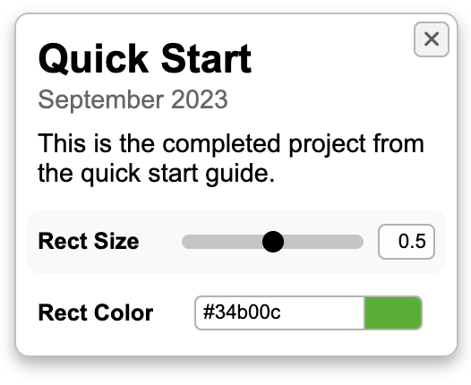

# Quick Start Guide

Welcome to the Quick Start Guide for Sketchbook. This guide will walk you through getting an instance of Sketchbook up and running locally, creating your first project, and exploring some basic configuration options.

### Fork the Repo

Sketchbook is an open source project hosted on GitHub. Though you are welcome to clone it directly for local use, forking the repository will make it much easier for you to [update](updating.md) Sketchbook, and [publish](deploying.md) your projects whenever you are ready to do so.

To fork the main Sketchbook repository, you can use [this direct link](https://github.com/flatpickles/sketchbook/fork). Select the owner (your GitHub account or organization), edit the name and description if you wish, and click the "Create fork" button. You now have a copy of Sketchbook in your GitHub account.

You must now clone your Sketchbook fork locally to use it. Navigate to your Sketchbook fork on GitHub, then click the "Code" dropdown, and choose whatever method you prefer to clone the repository.

_Forks on GitHub are public repositories. If you'd like to create a private Sketchbook, you'll need to duplicate the repository into a private mirror instead of forking; GitHub provides relevant instructions [here](https://docs.github.com/en/repositories/creating-and-managing-repositories/duplicating-a-repository)._

### Open Your Editor

Before proceeding, navigate into your local Sketchbook project: `cd sketchbook`

All Sketchbook projects will be contained within the `src/art` subdirectory, so you can just open that directly, e.g. `code src/art` if you use the VSCode CLI.

`src/art` in the `main` branch of Sketchbook includes only a simple readme file, which you can delete or edit as you see fit. If you're interested in a collection of example projects, see [`src/art`](https://github.com/flatpickles/sketchbook/tree/demo/src/art) in the `demo` branch!

_Sketchbook's global configuration files are located in `src/config`, not in `src/art`. For now, let's just focus on creating our first project!_

### Run Sketchbook Locally

Before running your dev server, you'll need to install all of Sketchbook's dependencies: `npm install`

You can now run the dev server with `npm run dev`. Once Sketchbook is running on your local machine (perhaps at [http://localhost:5173](http://localhost:5173)), the app will hot-reload any time you save a file. Make sure you have Sketchbook open in your browser before you proceed.

_Sketchbook is a SvelteKit project. You don't need to know anything beyond the basics noted here, but if you're interested in app implementation details, check out the [development notes](dev-notes.md)._

### Create Your First Project

Within `src/art`, create a new TypeScript or JavaScript file in a directory of the same name, e.g. `src/art/QuickStart/QuickStart.ts` (we'll use TypeScript below). For "QuickStart" to show up in the projects list, we need to export a default class in this file, extending the base [`Project`](https://github.com/flatpickles/sketchbook/blob/main/src/lib/base/Project/Project.ts) class:

```ts
import Project from '$lib/base/Project/Project';
export default class QuickStart extends Project {}
```

_The main project file (i.e the file with the name that matches its project subdirectory) must always export a `Project` subclass as its default._

### Get Pixels on the Screen

After selecting "QuickStart" in the project list panel, you won't see anything beyond a white screen. Let's change that! Define an `update` method within your new class, and have it draw a simple rectangle:

```ts
export default class QuickStart extends Project {
    update() {
        const ctx = this.canvas?.getContext('2d');
        if (!this.canvas || !ctx) return;

        ctx.fillRect(
            this.canvas.width / 4,
            this.canvas.height / 4,
            this.canvas.width / 2,
            this.canvas.height / 2
        );
    }
}
```

If you save and check your browser, your "QuickStart" project now features a black rectangle in the middle of the canvas.

_Sketchbook automatically makes an HTML canvas object available to `Project` instances via the `canvas` property. `update` is a lifecycle method that's automatically called on each animation frame. If you want to avoid null-checking `this.canvas` and its context (as above), you can use the `canvas` and `context` references in the props object passed to `update`. [todo: example, here or elsewhere]_

### Create Your First Parameter

Let's make the size and color of the rectangle customizable! To define Sketchbook parameters, all you need to do is define instance variables for your project class. Update your `QuickStart` class so it looks like this:

```ts
export default class QuickStart extends Project {
    rectSize = 0.5; // "Rect Size"
    rectColor = '#34b00c'; // "Rect Color"

    update() {
        const ctx = this.canvas?.getContext('2d');
        if (!this.canvas || !ctx) throw new Error('Canvas not set');

        ctx.clearRect(0, 0, this.canvas.width, this.canvas.height);
        ctx.fillStyle = this.rectColor;
        ctx.fillRect(
            (this.canvas.width * (1.0 - this.rectSize)) / 2,
            (this.canvas.height * (1.0 - this.rectSize)) / 2,
            this.canvas.width * this.rectSize,
            this.canvas.height * this.rectSize
        );
    }
}
```

We've added a couple things, most notably property definitions for `rectSize` and `rectColor`, each with a default value. We've also added a comment next to each, indicating its display name.

If you check back in the browser, Sketchbook has automatically created inputs for each in the project details panel on the right, and we can use these properties within our `Project` subclass to access and use the most recent values set in the UI.

_You can define many different types of parameters, including numbers, booleans, strings, and numeric arrays. Sketchbook also offers file input and more via class property definitions._

### Configure Your Project

Now that you have a parameterized code sketch set up, let's look at some basic configuration options. You can create a `config.json` alongside `QuickStart.ts` to impact the behavior and presentation of your project. Add this code within a new `src/art/QuickStart/config.json` file:

```json
{
    "title": "Quick Start",
    "date": "2023-09-19",
    "description": "This is the completed project from the quick start guide."
}
```

Here we're defining a title, date, and description for the project. Check your browser, and you'll see these changes reflected in the project details panel.



_Note that `rectColor` is displayed with a color picker input – Sketchbook has inferred from its name that this parameter is a color hex string. This is a parameter "style" that we could also have configured explicitly. To learn more, see the documentation for [parameter configuration](param-config.md)._

### Extra Credit: Make a Preset

Sketchbook makes it easy to create "presets", curated sets of parameter values that can be applied all at once. When you create one or more presets for a project, they'll appear in a selector UI above your parameter inputs.

Presets are derived from JSON files in a `presets` directory, within the main project directory. To try creating one for your Quick Start project, make a `presets` directory, and add this code within a new `src/art/QuickStart/presets/DemoPreset.json` file:

```json
{
    "title": "Demo Preset",
    "values": {
        "rectSize": 0.25,
        "rectColor": "#dd14ff"
    }
}
```

If you check back in your browser, you'll now see the preset selector above the params we defined earlier, and you can flip from the project's default values to "Demo Preset" by using the right arrow control, or the selector dropdown.


_See the [presets documentation](params-presets.md?id=presets-in-sketchbook) to learn more about working with presets in Sketchbook._

### What's Next

Hopefully you're feeling comfortable with the basics after this Quick Start, and you're ready to start building your own projects in Sketchbook! Come back to the docs listed in the index whenever you're interested in developing your understanding, or seeking reference materials in any particular area.

If you're feeling motivated, the Sketchbook docs are suitable for reading in top-top-bottom order. Continue onward into [Creating Project Files](file-structure.md) to keep learning.
