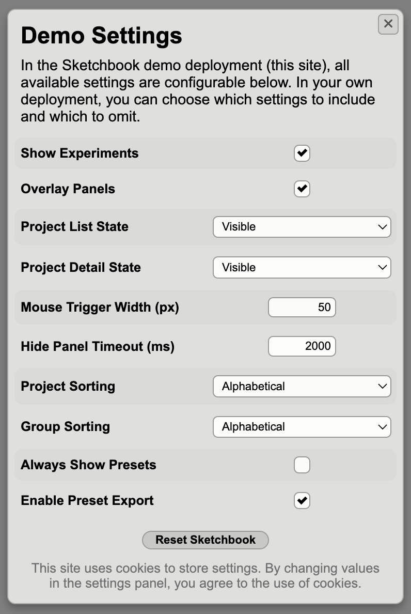

# App Settings

Sketchbook offers a number of settings that influence the behavior of the web app. Each of these settings can be configured within `src/config/settings.ts`, and also can be added to the "Settings" UI, shown by clicking the settings button at the bottom of the project list panel.

The [demo deployment](https://demo.skbk.cc) has all settings options visible and adjustable in the settings panel:

See the `settings.ts` file [on GitHub](https://github.com/flatpickles/sketchbook/blob/main/src/config/settings.ts) or in your code editor for commented descriptions of each option, and configure your preferences by editing this file in your Sketchbook.

To make any of these settings adjustable in the app's settings panel, you can add an entry in the `userSettingsLabels` record, mapping the setting key to a display name string. Any values changed in the settings panel will be persisted in cookies, and the values defined in `settings.ts` will be used as defaults. Sketchbook doesn't use cookies until settings values are explicitly changed within the app, and a consent warning is shown within the settings pane for cookie law compliance.
