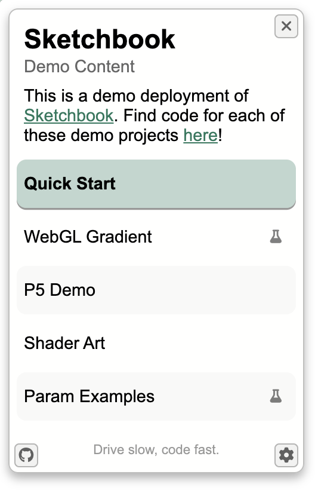
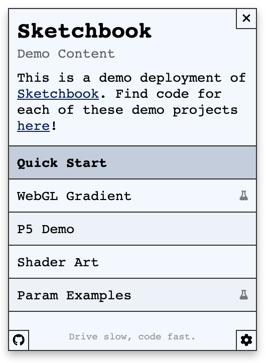

# Theme & Styling

Sketchbook's visual appearance can be deeply customized by changing the many SCSS variables within `src/config/theme.scss`. The styling system in Sketchbook has been designed to be as customizable as possible, without requiring any additional styling code. Typography, colors, spacing, animation timing, and more are all defined via adjustable variables.

There are too many options to discuss in detail within this document, but the styling options in `theme.scss` are grouped into annotated sections, and are named descriptively; see the `theme.ts` file [on GitHub](https://github.com/flatpickles/sketchbook/blob/main/src/config/theme.scss) or in your code editor. This file contains SCSS variables that style both the desktop & mobile UIs for Sketchbook.

To get you started in a few different styling directions, you can try out any of the following theme options, all stored within `src/config/themes` in the Sketchbook [demo branch](https://github.com/flatpickles/sketchbook/tree/demo/src/config/themes).

#### [`theme1.scss`](https://github.com/flatpickles/sketchbook/blob/demo/src/config/themes/theme1.scss)

#### [`theme2.scss`](https://github.com/flatpickles/sketchbook/blob/demo/src/config/themes/theme2.scss)

#### [`theme3.scss`](https://github.com/flatpickles/sketchbook/blob/demo/src/config/themes/theme3.scss)

