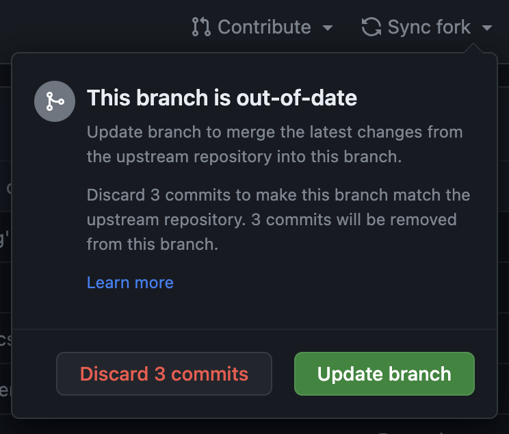
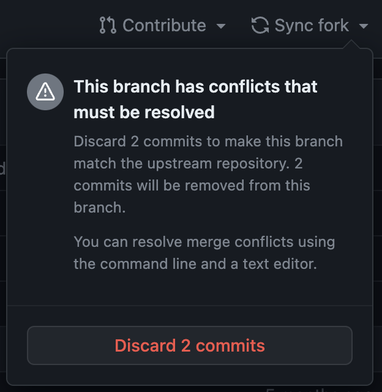

# Updating Sketchbook

Sketchbook is an active project, and it will continue improving over time via ongoing work in the main [GitHub repository](https://github.com/flatpickles/sketchbook). You will likely want to keep your own copy of Sketchbook up to date, so you can take advantage of new features, bug fixes, and other improvements. Read on to learn how you can stay up-to-date.

## Notes on Versioning

Sketchbook's development adheres to [Semantic Versioning ](https://semver.org/), whereby each successive update is given a `[major].[minor].[patch]` version number, e.g. `1.2.36`. Minor & patch version increments will be backwards compatible, i.e. updating to a new version of Sketchbook with the same major version number shouldn't break any of your projects (please [file an issue](https://github.com/flatpickles/sketchbook/issues/new) if it does).

Each major and minor release will be accompanied by [release notes](https://github.com/flatpickles/sketchbook/releases). The current Sketchbook version number is noted in [package.json](https://github.com/flatpickles/sketchbook/blob/main/package.json), and you can compare this with the same file in your local Sketchbook.

_**Note:** As of this writing, Sketchbook is still in a 0.x version, which means any part of the project may be subject to breaking changes. Keep an eye out for a 1.0 release, coming soon!_

## Syncing Your Fork

If you're working from a fork of Sketchbook (as described in the [quick start guide](quick-start.md)), you can absorb recent changes by "syncing" your fork with the main repo. Before continuing, make sure that any local changes have been committed and pushed up to your fork's "origin" on GitHub (YOUR_USERNAME/sketchbook.git). We'll refer to the main Sketchbook repository (flatpickles/sketchbook.git) as the "upstream" repository.

You'll know if you need to sync your fork with the upstream if you see an "X commits behind" message in the GitHub web UI for your fork:


### Syncing Without Conflicts (Merge)

If your changes are contained only within your `src/art` directory, you should be able to sync your fork easily from the GitHub web UI. Clicking the "Sync fork" dropdown then selecting "Update branch" will automatically pull in changes from the upstream repository. After you do this, you can `git pull` from your local Sketchbook directory, and get right back to work.



It's worth noting that GitHub's auto-sync option creates a **merge commit** in your Sketchbook fork. This can be fine, though you may prefer a rebase workflow (discussed [below](updating.md?id=syncing-with-rebase)).

### Syncing With Conflicts (Merge)

If you've changed code files within Sketchbook's app code, or in some cases when you've changed the files within `src/config`, you may need to resolve conflicts with upstream changes. If "Sync repo" shows a conflict warning, and you don't want to discard the conflicting commits, you'll need to resolve these conflicts manually.



To configure your local Sketchbook repo to pull in changes from the upstream Sketchbook repo, add a new upstream remote for your fork as described [here](https://docs.github.com/en/pull-requests/collaborating-with-pull-requests/working-with-forks/configuring-a-remote-repository-for-a-fork). You'll only need to do this once.

```
git remote add upstream https://github.com/flatpickles/sketchbook.git
```

Once you have the upstream repository listed as a remote (i.e. flatpickles/sketchbook.git appears in `git remote -v`), you can pull down the upstream changes, and resolve local conflicts. First, check out your main branch, and fetch the upstream changes:

```
git checkout main
git fetch upstream
```

You can then follow a local merge workflow to resolve these conflicts, something like this:

```
git merge upstream/main
git mergetool
[resolve conflicts as you see fit]
git add .
git commit -m "Merge branch 'flatpickles:main' into main"
git push
```

GitHub's [documentation](https://docs.github.com/en/pull-requests/collaborating-with-pull-requests/working-with-forks/syncing-a-fork) on fork syncing may also be a helpful reference.

### Syncing with Rebase

Despite some added complexity, there are many benefits to a rebase workflow. One of these benefits is cleanly preserving the distinction between your commits and those in the upstream repo, which helps with long-term maintainability in a codebase. Using rebase to sync your Sketchbook fork looks something like this:

```
git checkout main
git fetch upstream
git rebase upstream/main
git mergetool
[resolve conflicts as you see fit]
git add .
git rebase --continue
git push --force
```

If you've been using merges as described above (e.g. with GitHub's auto-sync), you may still be able to rewrite your local git history to remove previous merge commits. If you don't currently have any conflicts with the upstream repository, this should work:

```
git checkout main
git fetch upstream
git rebase upstream/main
git push --force
```

## For Private Sketchbooks

The process for updating a private Sketchbook mirror is similar to the above. GitHub's [setup](https://docs.github.com/en/repositories/creating-and-managing-repositories/duplicating-a-repository) documentation is helpful, as is [this gist](https://gist.github.com/0xjac/85097472043b697ab57ba1b1c7530274), which includes helpful notes on updating a private fork.
